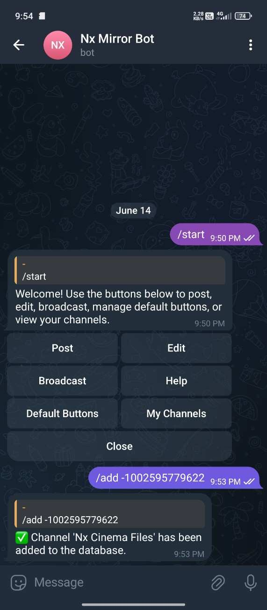

Telegram bot to post, edit, and broadcast messages with inline buttons across unlimited channels. Easy to use and manage.
manage unlimited channels from one bot.
> **NOTE:** This bot is designed for **personal use only**.

## Features

<details>
<summary>Click to See Features </summary>

AutoPostBot helps you manage Telegram channels efficiently with the following capabilities:
- Post creation with support for text, media, and inline buttons
- Manage Unlimited Channels From one bot
- Edit any existing post in an added channel, including older posts — with the ability to update content or add new buttons.
- Broadcast messages in all channels  
- Channel management interface with add/remove support  
- Set and reuse default buttons across all posts  
- Preview-confirm workflow before publishing  
- Smart buttons: URL, popup alerts, inline sharing, and more (popup/alerts have some bugs will fixed in next version)
- GUI-based default button and channel management  
- Built-in guidance and validation for new users  

</details>

## Screenshot

<details>
<summary>Click to view</summary>



</details>

# Deployment Guide

**Easy Way:** 

[](https://heroku.com/deploy?template=https://github.com/ftkrishna/AutoPostBot)

---

## Deploying via Heroku CLI

1. Clone the repository:
   ```bash
   git clone https://github.com/ftkrishna/AutoPostBot
   cd AutoPostBot
   ```

2. Login to Heroku:
   ```bash
   heroku login
   ```

3. Create a new Heroku app:
   ```bash
   heroku create your-app-name
   ```

4. Set Heroku stack to container:
   ```bash
   heroku stack:set container
   ```

5. Deploy the bot:
   ```bash
   git add .
   git commit -m "Deploy"
   git push heroku main
   ```

6. View logs:
   ```bash
   heroku logs --tail
   ```

---

## Deploying via Heroku Dashboard

1. Visit [https://dashboard.heroku.com/](https://dashboard.heroku.com/)
2. Fork this repository
3. Create new Heroku app
4. Connect GitHub Repository 
5. Select Branch & Deploy
---

## Deploy Locally

1. Clone the repo:
   ```bash
   git clone https://github.com/ftkrishna/AutoPostBot
   cd AutoPostBot
   ```

2. Create a virtual environment:
   ```bash
   python3 -m venv venv
   source venv/bin/activate
   ```

3. Install requirements:
   ```bash
   pip install -r requirements.txt
   ```

4. Run the bot:
   ```bash
   bash start.sh
   ```


## License & Copyright

© 2025 FtKrishna. All rights reserved.
This project, AutoPostBot, is released under the [MIT License](LICENSE).  
You are free to use, modify, and distribute it — just remember to tag me.
